#1 Samba - OpenSUSE


#1 Servidor OpenSuse
* Configurar el servidor OpenSuse con siguientes valores:
    * Nombre de usuario: Michele
    * Clave del usuario root: DNI-del-alumno
    * Nombre de equipo: samba-server
    * Nombre de dominio: donofrio
    * Comprobar que tenemos instalado openssh-server.
* Añadir en /etc/hosts los equipos samba-cli1 y samba-cli2-10

Comprobamos esto con loscomandos siguientes:

```
hostname -f
ip a
lsblk
sudo blkid
```

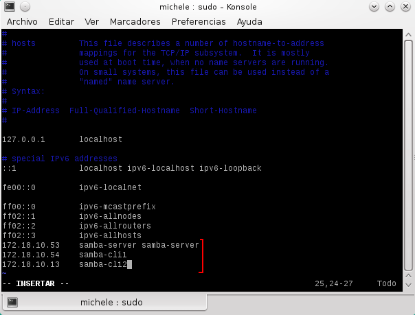

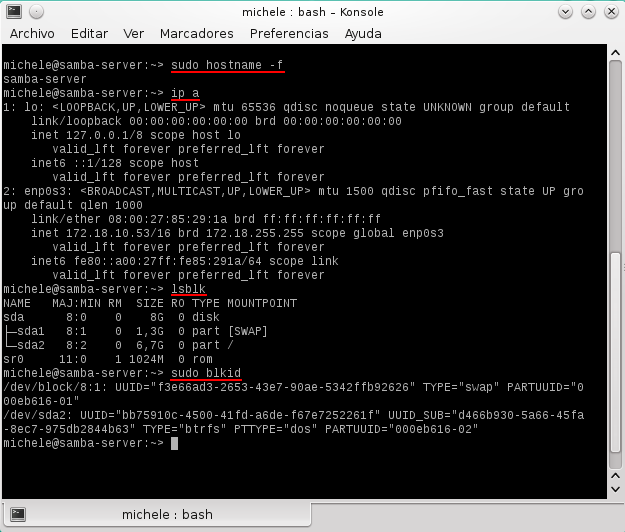

##1.1 Usuarios locales

Vamos a creamos los siguientes grupos y usuarios:

* Grupo `jedis` con `jedi1`, `jedi2` y `supersamba`.
* Grupo `siths` con `sith1` y `sith2` y `supersamba`.
* Crear el usuario `smbguest`. Para asegurarnos que nadie puede usar `smbguest` para 
entrar en nuestra máquina mediante login, vamos a modificar en el fichero `/etc/passwd` de la 
siguiente manera: "smbguest: x :1001:1001:,,,:/home/smbguest:**/bin/false**".
* Crear el grupo `starwars`, y dentro de este poner a todos los `siths`, `jedis`, `supersamba` y a `smbguest`.

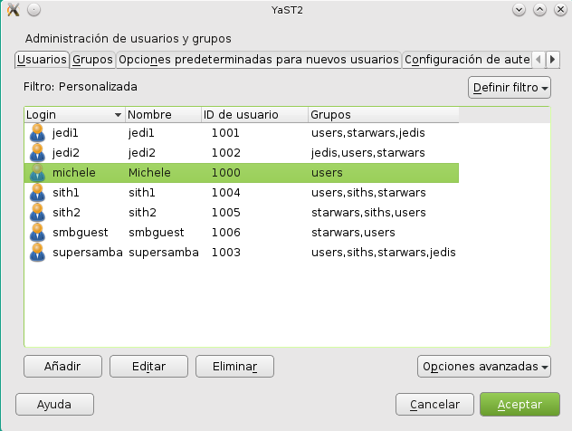

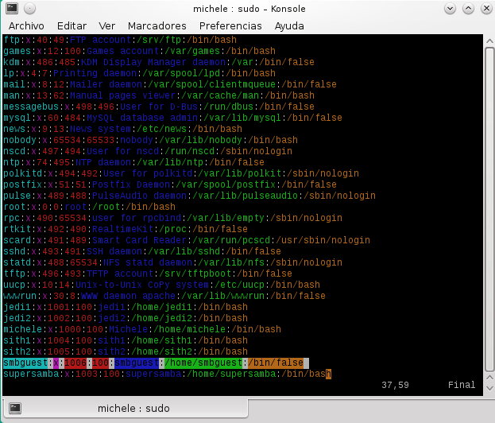

##2 Instalar Samba

* Vamos a instalar Samba en el servidor mediante comandos por ejemplo, también podemos hacerlo mediante el entorno gratifico Yast.

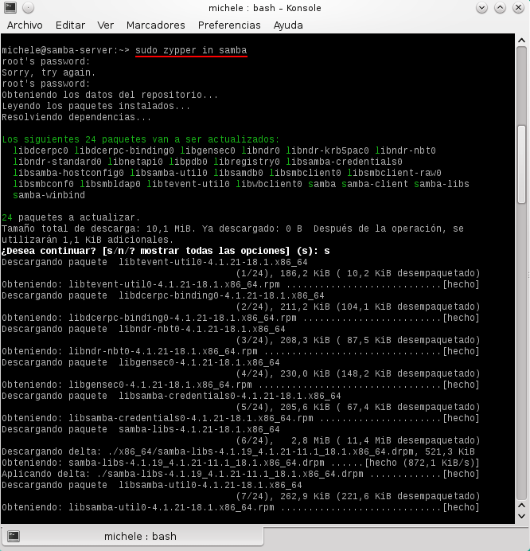

##2.1 Crear las carpetas para los recursos compartidos
Capturar imagen del resultado final.

* Vamos a crear las carpetas de los recursos compartidos con los permisos siguientes:

    * `/var/samba/public.d`
        * Usuario propietario `supersamba`.
        * Grupo propietario `starwars`. 
        * Poner permisos 775.
    * `/var/samba/corusant.d`
        * Usuario propietario `supersamba`.
        * Grupo propietario `siths`. 
        * Poner permisos 770.
    * `/var/samba/tatooine.d`
        * Usuario propietario `supersamba`.
        * Grupo propietario `jedis`. 
        * Poner permisos 770.

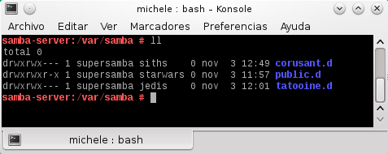

##2.2 Configurar Samba

* Vamos a hacer una copia de seguridad del fichero de configuración existente 
`cp /etc/samba/smb.conf /etc/samba/smb.conf.000`.

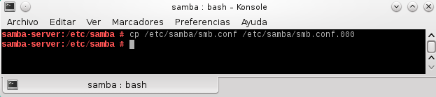

* Vamos a configurar el servidor Samba con las siguientes opciones de configuración:


```
[global]
netbios name = linares10
workgroup = STARWARS
server string = Servidor Samba del PC 10
security = user
map to guest = bad user
guest account = smbguest

[cdrom]
path = /dev/cdrom
guest ok = yes
read only = yes

[public]
path = /var/samba/public.d
guest ok = yes
read only = yes

[corusant]
path = /var/samba/corusant.d
read only = no
valid users = @siths

[tatooine]
path = /var/samba/tatooine.d
read only = no
valid users = jedi1, jedi2
```

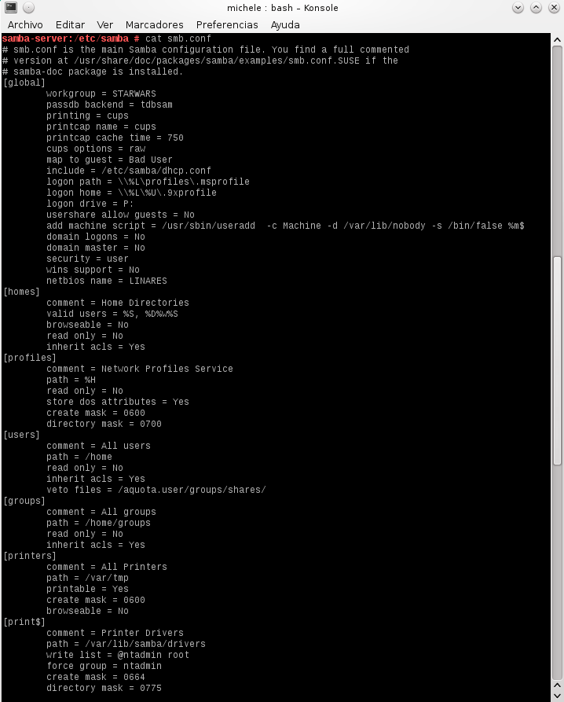

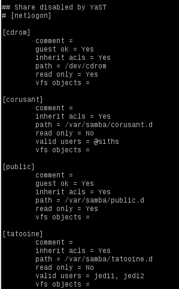

##2.3 Usuarios Samba
Después de crear los usuarios en el sistema, hay que añadirlos a Samba.

* Al terminar comprobamos nuestra lista de usuarios Samba con el comando: `pdbedit -L`

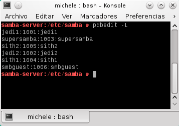

##2.4 Reiniciar
* Ahora que hemos terminado con el servidor, hay que reiniciar el servicio 
para que se lean los cambios de configuración (Consultar los apuntes): 
* `systemctl stop smb`, `systemctl start smb`, `systemctl status smb`
* `systemctl stop nmb`, `systemctl start nmb`, `systemctl status nmb`

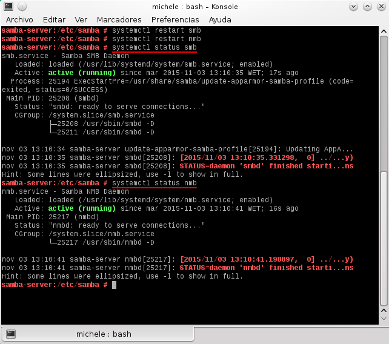

* Comprobamos:
`testparm (Verifica la sintaxis del fichero de configuración del servidor Samba)`

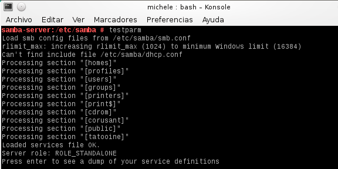

`sudo netstat -tap (Vemos que el servicio SMB/CIF está a la escucha)`


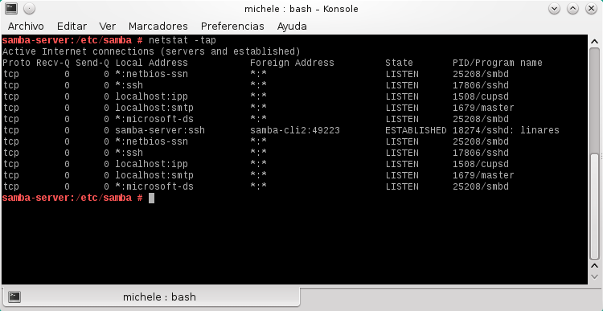

#3. Windows
##3.1 Cliente Windows

Desde un cliente Windows trataremos de acceder a los recursos compartidos del servidor Samba.

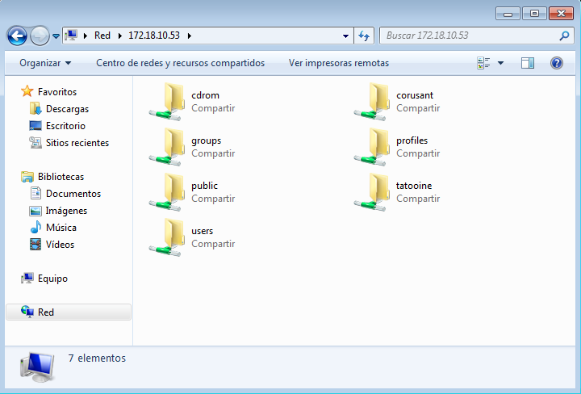

* Comprobamos el acceso como si fuéramos un `jedi1` por ejemplo. Debería funcionar con el resto también.

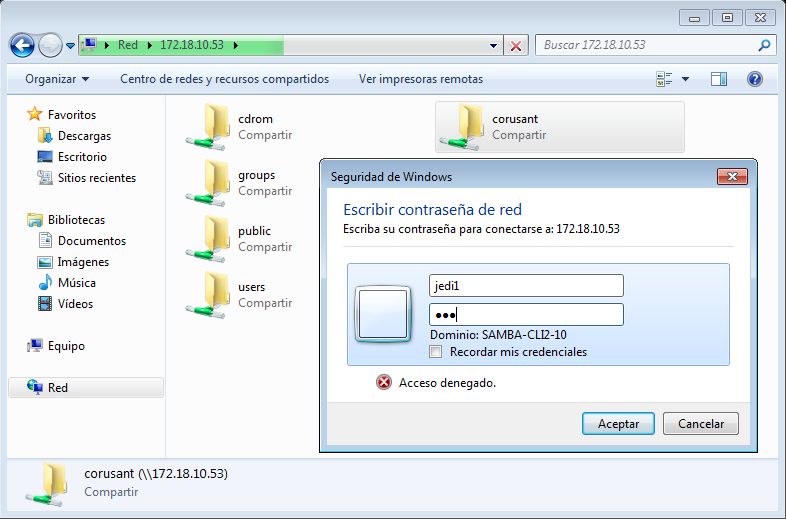


* Para comprobar resultados, desde el servidor Samba ejecutamos: `smbstatus`, `netstat -ntap`

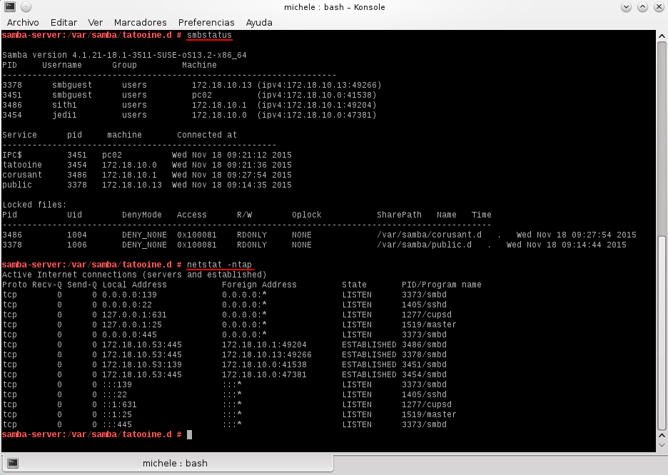

##3.3 Cliente Windows comandos

* Vamos a conectarnos desde la máquina Windows al servidor Samba usando los comandos net. 

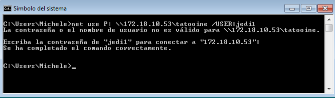

* Por ejemplo el comando `net use P: \\192.168.10.1\tatooine /USER:jedi1` establece una conexión del recurso Tatooine en la unidad P. Ahora podemos entrar en la unidad P ("p:") y crear carpetas, etc.

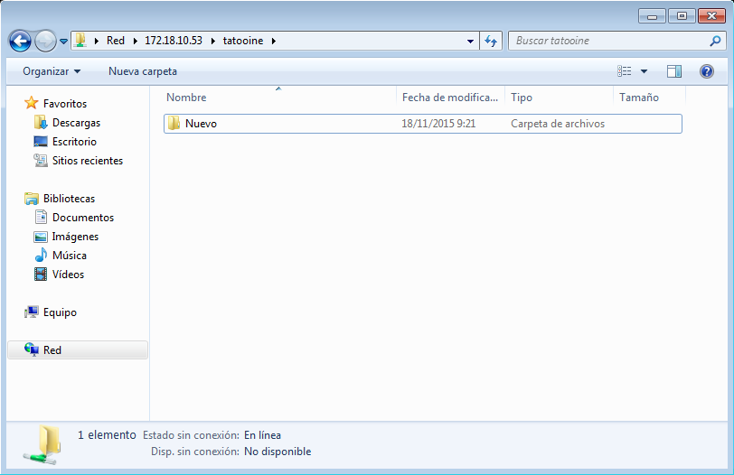

Capturar imagen de los comandos siguientes:
* Para comprobar resultados, desde el servidor Samba ejecutamos: `smbstatus`, `netstat -ntap`

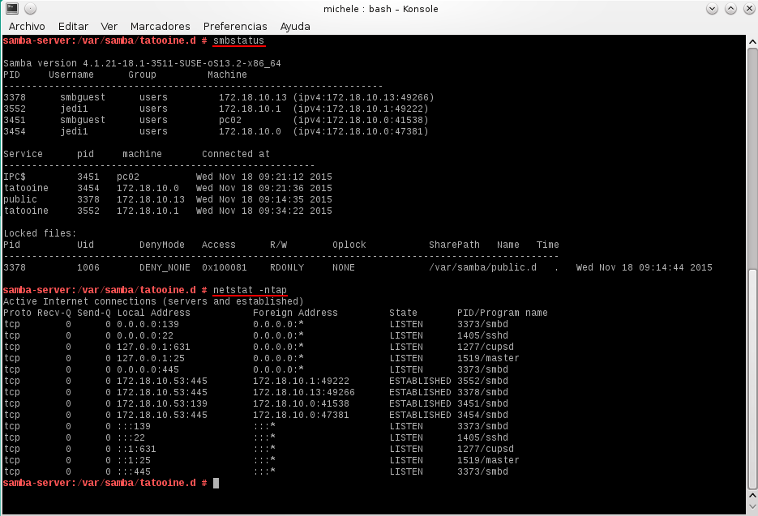

#4 Cliente GNU/Linux
##4.1 Cliente GNU/Linux GUI

Desde en entorno gráfico, podemos comprobar el acceso a recursos compartidos SMB/CIFS, en nuestro caso usamos Konqueror en KDE .

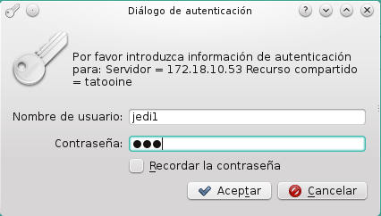

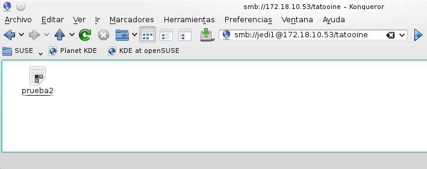

* Comprobar que el recurso `public` es de sólo lectura.

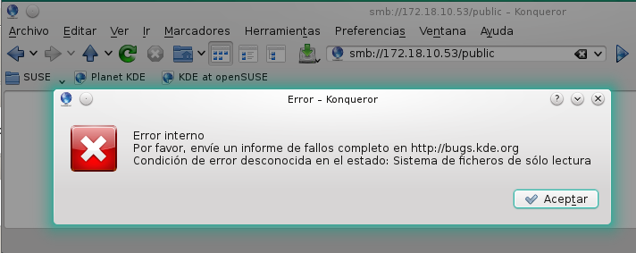

* Para comprobar resultados, desde el servidor Samba ejecutamos: `smbstatus`, `netstat -ntap`

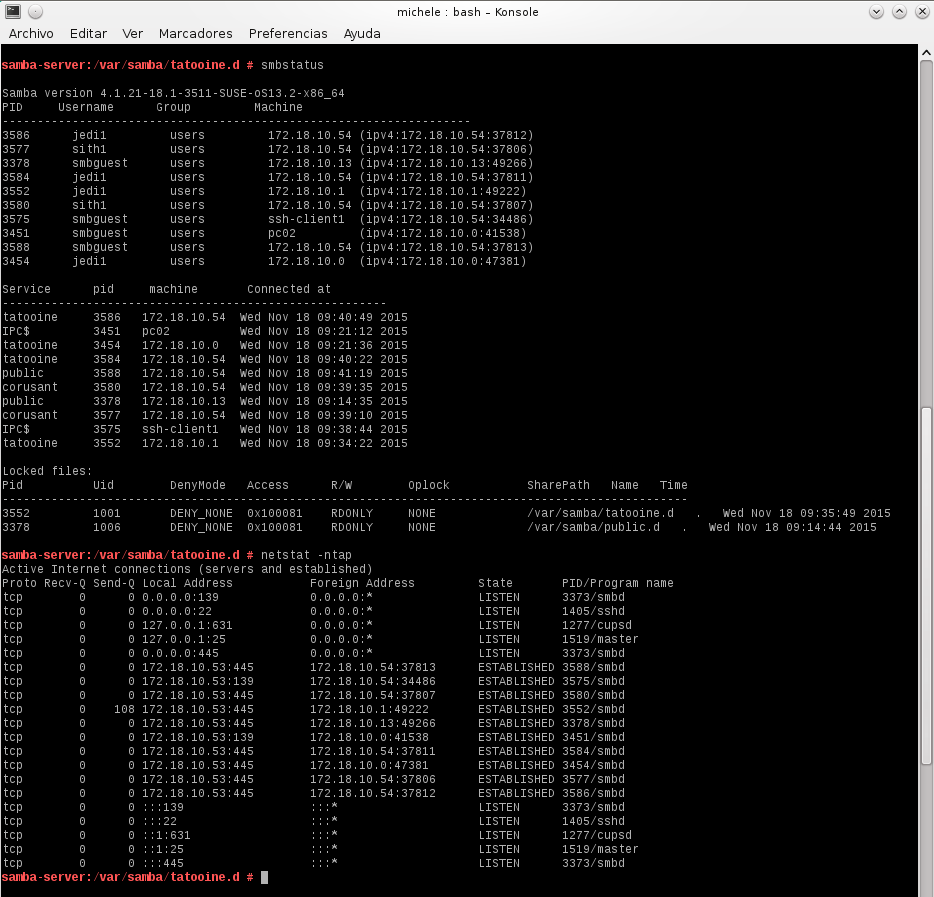

##4.2 Cliente GNU/Linux comandos

* Vamos a un equipo GNU/Linux que será nuestro cliente Samba. Desde este 
equipo usaremos comandos para acceder a la carpeta compartida.
* Primero comprobar el uso de las siguientes herramientas:
`sudo smbtree	(Muestra todos los equipos/recursos de la red SMB/CIFS)`

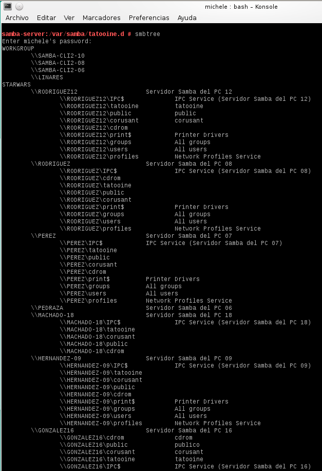

`smbclient --list 192.168.10.1  (Muestra los recursos SMB/CIFS de un equipo concreto)`

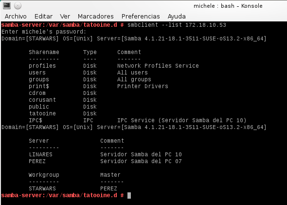

* Ahora crearemos en local la carpeta `/mnt/samba-remoto/corusant`.
* MONTAJE: Con el usuario root, usamos el siguiente comando para montar un recurso compartido de Samba Server, como si fuera una carpeta más de nuestro sistema. Ejecutar el comando `df -hT`. Veremos que el recurso ha sido montado.
`mount -t cifs //172.18.XX.55/corusant /mnt/samba-remoto/corusant -o username=sith1`

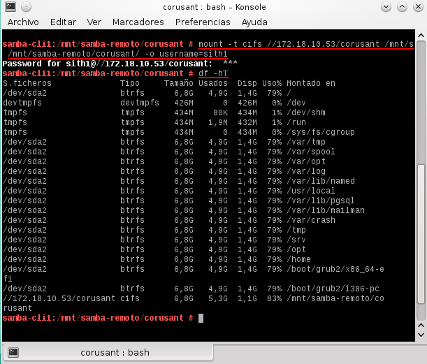

* Para comprobar resultados, desde el servidor Samba ejecutamos: `smbstatus` y `netstat -ntap`.

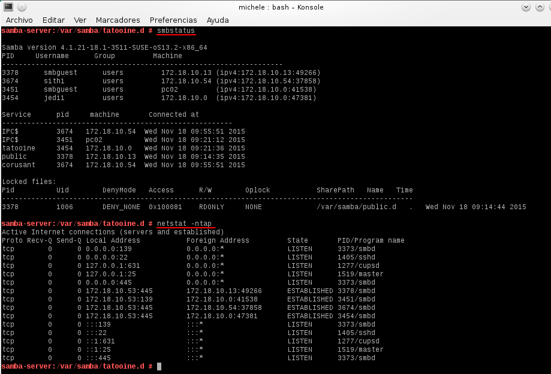

##4.3 Montaje automático


Acabamos de acceder a los recursos remotos, realizando un montaje de forma manual (comandos mount/umount). 
Si reiniciamos el equipo cliente, podremos ver que los montajes realizados de forma manual ya no están (`df -hT`).
Si queremos volver a acceder a los recursos remotos debemos repetir el proceso de  montaje manual, a no ser que hagamos una configuración de  montaje permanente o automática.

* Para configurar acciones de montaje automáticos cada vez que se inicie el equipo, 
debemos configurar el fichero `/etc/fstab`. Veamos un ejemplo:

`//ip-del-servidor-samba/public /mnt/samba-remoto/public cifs username=sith1,password=clave 0 0`

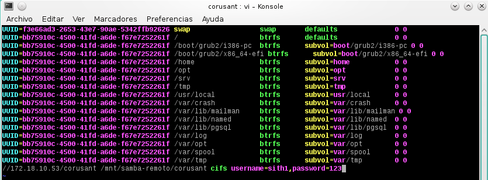

* Reiniciar el equipo y comprobar que se realiza el montaje automático al inicio.

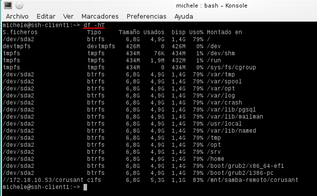

* Guardamos del fichero `/etc/fstab`.

	[fstab](fstab)

#5. Preguntas para resolver

* ¿Las claves de los usuarios en GNU/Linux deben ser las mismas que las que usa Samba?

	Las claves de usuarios son para autenticarse mientras que las de Samba son para la conexion remota.

* ¿Puedo definir un usuario en Samba llamado sith3, y que no exista como usuario del sistema?
	
	No, no seria posible conectartse ya que no existe en el sistema.

* ¿Cómo podemos hacer que los usuarios sith1 y sith2 no puedan acceder al sistema pero sí al samba? 
(Consultar `/etc/passwd`)

	Podemos modificar su clave para que no puedan acceder.

* Añadir el recurso `[homes]` al fichero `smb.conf` según los apuntes. ¿Qué efecto tiene?

	Estariamos compartiendo nuestro home en Samba.