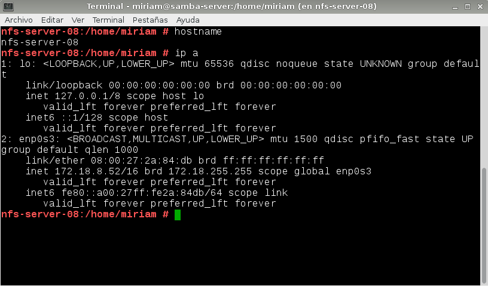
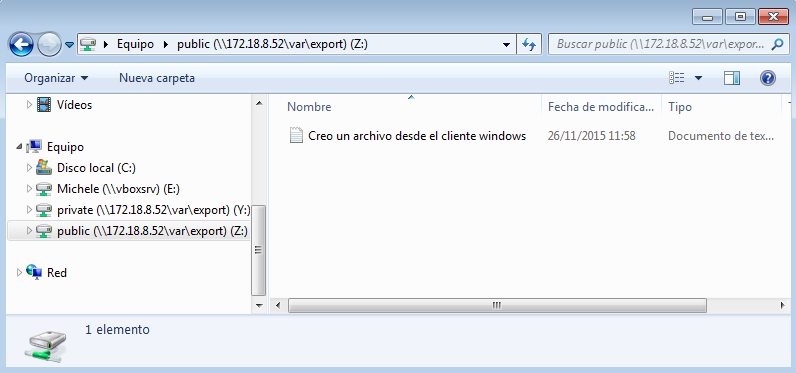

#NFS (Network File System)

NFS es una forma de crear recursos en red para compartir con sistemas heterogéneos.

#1. SO Windows

Vamos a usar 2 máquinas:
* MV Windows 2008 Server (Enterprise) como servidor NFS.
    * El nombre de esta máquina sera: "Linares10WS".
    * IP estática: 172.18.10.22
    * Grupo de trabajo: AULA108

    

    

* MV Windows (Enterprise) como cliente NFS.
    * El nombre de esta máquina sera: "Linares10WC".
    * IP estática 172.18.10.12
    * Grupo de trabajo: AULA108

    

    
    

##1.1 Servidor NFS Windows

Instalación del servicio NFS en Windows 2008 Server
* Agregamos el rol `Servicios de Archivos`y damos a siguiente.

	

* Ahora marcamos `Servicios para NFS`.

	

Configurar el servidor NFS de la siguiente forma:
* Creamos la carpeta `c:\export\public`. Nos vamos a: `Propiedades -> Uso compartido NFS`, Acivamos la casilla para compartir esta carpeta y le damos permisos `lectura/escritura` para todos.

	

* Crear la carpeta `c:\export\private`. Nos vamos a: `Propiedades -> Uso compartido NFS`, Activamos la casilla para compartir esta carpeta y le damos permisos de `lectura` para todos.

	

* Ejecutamos el comando `showmount -e ip-del-servidor`, para comprobar los recursos compartidos.

	

##1.2 Cliente NFS

**Instalamos el soporte cliente NFS bajo Windows**
* Vamos a instalar el componente cliente NFS para Windows. Para ello vamos a `Panel de Control -> Programas -> Activar o desactivar características de Windows`.
* Nos desplazamos por el menú hasta localizar Servicios para NFS y dentro de este, Cliente NFS. 

	

**Iniciamos el servicio cliente NFS.**
* Para iniciar el servicio NFS en el cliente, mediante una consola con permisos de Administrador ejecutamos el siguiente comando: `nfsadmin client start`

	

**Montando el recurso**

Ahora necesitamos montar el recurso remoto para poder trabajar con él.

Esto no lo hacemos con Administrador, sino con nuestro usuario normal.
* Montar recurso remoto: `mount –o anon,nolock,r,casesensitive \\\172.18.10.22\public *`
* Comprobar: `net use`
* Comprobar: `showmount -a 172.18.10.22`

	
	
* En el servidor ejecutamos el comando `showmount -e 172.18.10.22`, para comprobar los recursos compartidos.

	
    

* La letra de la unidad se asigna de forma automática, así que nos asignará la Z.

	

* Podemos comprobar que desde el cliente, accediendo a la carpeta `public`, no podemos crear nada ya que solo tenemos permisos de lectura.

	

#2. SO OpenSUSE

Vamos a necesitar 2 máquinas GNU/Linux:

* MV OpenSUSE, será nuestro servidor NFS
	* Nombre de la máquina: nfs-server-08, tendremos que modificar el fichero '/etc/hostname' para establecer el nombre de la máquina.
	* IP estática 172.18.08.52
	* Modo puente
	
	

    
    
* MV OpenSUSE, será nuestro cliente NFS:
	* Nombre de la máquina: nfs-client-08
	* IP estática 172.18.08.62
	* Modo puente
	
	

    
   
##2.1. Servidor NFS

* Instalamos el servidor NFS por Yast. También podríamos instalarlo mediante la consola: 'apt-get install nfs-server'

* Creamos las siguientes carpetas y les asignamos permisos:

	

* Configuramos el servidor NFS, abrimos el puerto en el cortafuegos e iniciamos automáticamente con el arranque:

	

* Añadimos los recursos compartidos, y los configuramos de manera que en 'public' pueda acceder cualquiera y en 'private' solo la máquina cliente:

	

	

* Para iniciar y parar el servicio NFS, podemos hacerlo directamente desde el Yast o mediante comandos: 'systemctl start nfsserver.service'

* Lo comprobamos ejecutando 'showmount -e localhost', este comando nos muestra la lista de recursos exportados por el servidor NFS.

	

* Comprobamos que el servicio está activo:

	

##2.2. Cliente NFS

Comprobamos que las carpetas del servidor son accesibles desde el cliente:
	
* Primero comprobamos la conectividad desde el cliente hacia el servidor:
	
	
	
* Ejecutamos nmap para escanear y averiguar que servicios está ofreciendo la IP que escaneemos al exterior:
	
	
	
* Mostramos la lista de recursos exportados por el servidor NFS:
	
	

* Ahora pasamos a montar y usar cada recurso compartido. Primero creamos la carpeta '/mnt/remoto', y lo montamos directamente desde Yast:

	

* Ejecutando el comando 'df -hT' nos aparecerá el recurso montado:

	
	
* Haremos lo mismo con el recurso 'private'

	
	
* Ya podemos crear carpetas o ficheros dentro de public, pero sólo nos permitirá leer en private:

	* Creamos un fichero dentro de public sin problema:

	
	
	* Entramos en private e intentamos crear un fichero, vemos que nos indica que solo tenemos permisos de lectura:

	
	
##2.3. Montaje automático

* Para que los recursos se monten automáticamente cada vez que se inicie el equipo en OpenSUSE usamos Yast o bien modificamos la configuración directamente en el fichero '/etc/fstab':

	
	
<<<<<<< HEAD
=======
	
#3. Preguntas	

* ¿Nuestro cliente GNU/Linux NFS puede acceder al servidor Windows NFS? Comprobarlo.

* ¿Nuestro cliente Windows NFS podría acceder al servidor GNU/Linux NFS? Comprobarlo.

	* Montamos los dos recusos Linux en nuestro cliente Windows con los siguientes comandos:

		
		
	* Comprobamos que se han montado.

		
		
	* En Public comprobamos que podemos crear y eliminar archivos.

		
		
	* En Private comprobamos que no podemos crear ni eliminar.

		

>>>>>>> ups/master

