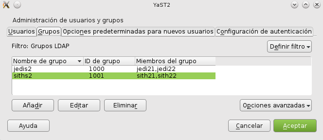

#Servidor LDAP - OpenSUSE

##1.1 Preparar la máquina

* Vamos a configurar una máquina virtual OpenSUSE para un servidor LDAP con:

    * IP estática del servidor 172.18.10.51 
    * Nombre equipo: `ldap-server10`
    * Dominio: `curso1516`
    * Con los siguintes comandos comprobamos lo anterior: `ip a`, `hostname -f`, `lsblk`, `blkid`

	

   * Además en `/etc/hosts` añadiremos:
`127.0.0.2   ldap-server10curso1516   ldap-server10`
`127.0.0.3   michele10.curso1516  michele10`

	


##1.2 Instalación y configuración del Servidor LDAP
* Procedemos a la instalación del módulo Yast para gestionar el servidor LDAP (`yast2-auth-server`).

	

* Ahora nos dirigimos a Yast y vamos a configurar LDAP con la herramiente q acabamos de instalar llamada *Servidor de autenticación*.

	
   
* Tipo de servidor: autónomo

	
   
* Usar como DN el siguiente: `dc=michele10, dc=curso1516` y la contraseña.

	

* NO habilitar kerberos.

	
   
* Una vez instalado, comprobar que el servicio `slapd` este iniciado y si se inicia automáticamente al reiniciar la máquina. 

	


##1.3. Crear usuarios y grupos en LDAP
Ahora vamos a introducir datos de usuarios y grupos
en el servidor LDAP, para ello debemos:

* Instalar el paquete `yast2-auth-client`, que nos ayudará a configurar la máquina para autenticación.

	

* Ejecutamos en YAST el *cliente de autenticación* que acabamos de instalar y añadimos un nuevo dominio.

	

* El parámetro LDAP URI es un localizador del recurso de la base de datos LDAP. Que configuramos como en la imagen.

	


* Crear los usuarios `jedi21`, `jedi22`, `sith21`, `sith22` 

	

* Crear los grupos LDAP `jedis2` y `siths2`

	

* Descargamos ahora la herramienta `gq` que es un browser LDAP para comprobar a información que tenemos en la base de datos LDAP.

	

* Comprobamos el árbol de datos LDAP que se nos ha creado automáticamente con los usuarios y los grupos.

	

* Con el siguiente omando , podemos hacer una consulta en la base de datos LDAP de la información de un usuario.
`ldapsearch -x -L -u -t "(uid=jedi22)"`

	

##1.4. Autenticación
Con autenticacion LDAP prentendemos usar una máquina como servidor LDAP, donde se guardará la información de grupos, usuarios, claves, etc. Y desde otras máquinas conseguiremos autenticarnos (entrar al sistema) con los usuarios definidos no en la máquina local, sino en la máquina remota con LDAP. Una especie de *Domain Controller*.

* Queremos iniciar sesión en la MV `ldap-server10` usando los usuarios definidos en el LDAP, pero como podemos apreciar en la captura no podemos acceder a el usuario LDAP en nuestra sesión actual, entonces debemos logearnos como *Root* para poder cambiar a el usuario LDAP sin problemas.

	

* Capturamos una imagen con la salida de los siguientes comandos para el usuario `jedi22` por ejemplo:

```
hostname -f (Muestra nombre de la MV actual)
ip a (Muestra datos de red de la MV actual)
date
cat /etc/passwd |grep jedi22 (No debe existir este usuario en la MV local)
finger jedi22
id jedi22
su jedi22
```

	

