	Michele linares D'onofrio
	

#1. Acceso remoto SSH
-

Vamos a utilizar las siguientes máquinas virtuales:

+ Un servidor OpenSUSE, con IP estática (172.18.10.53).
+ Un cliente OpenSUSE, con IP estática (172.18.10.54).
+ Un cliente Windows7, con IP estática (172.18.10.13).

##1.1 Configuración de red
Para configurar la red en OpenSUSE lvamos a utilizar la interfaz gráfica `yast`

+ En la configuración de la tarjeta de red asignamos la IP fija  para cada MV.

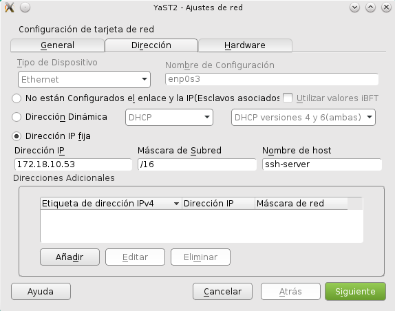

+ En la pestaña `Nombre de Host/DNS` asignamos los datos siguientes:

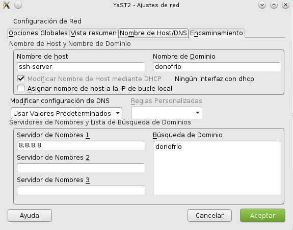

+ En la pestaña `Encaminamiento` elegimos al puerta de enlace y el dispositivo ( tarjeta de red ) asociado.

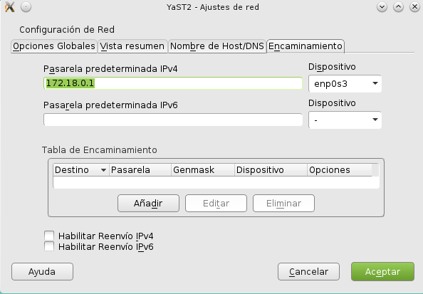


#2. Preparativos
-
##2.1 Servidor SSH

* Configurar el servidor OpenSuse con siguientes valores:
    * Nombre de usuario: Michele
    * Nombre de equipo: ssh-server
    * Nombre de dominio: donofrio
    
    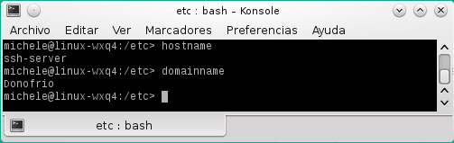
    
+ Añadir en /etc/hosts los equipos ssh-client1 y ssh-client2-10.

	
	
* Comprobar haciendo ping.

	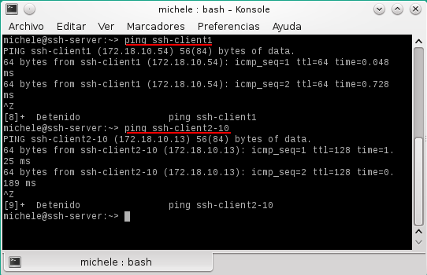

* Creamos 4 usuarios `Linares` en ssh-server:
    
    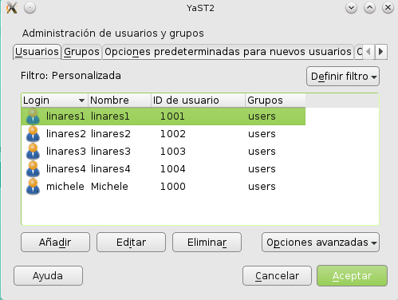

##2.2 Cliente OpenSuse
* Configuramos el cliente1 con:
	*  IP estática 
    * Nombre de usuario: michele
    * Clave del usuario root: DNI-del-alumno
    * Nombre de equipo: ssh-client1
    * Nombre de dominio: donofrio

    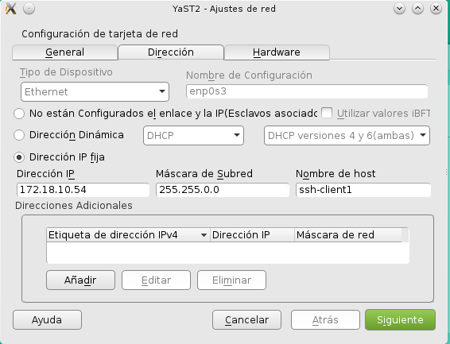 
    
    
    
* Añadir en /etc/hosts el equipo ssh-server, y ssh-client2-10.

	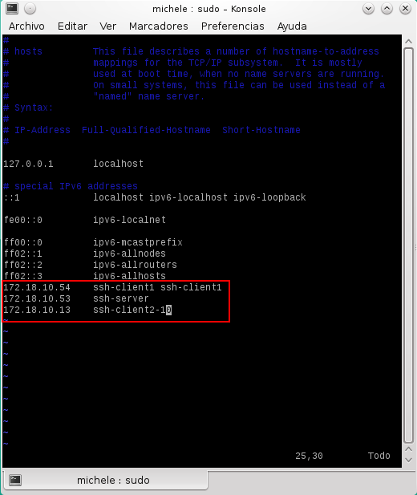

* Comprobar haciendo ping a ambos equipos. 
* 
	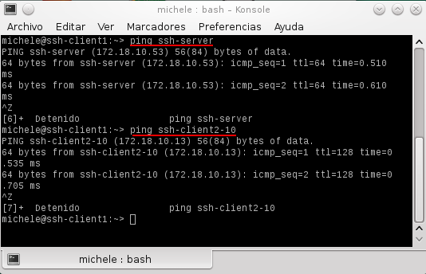

##2.3 Cliente Windows

* Descargamos el software cliente SSH en Windows (PuTTY) desde la página oficial.

	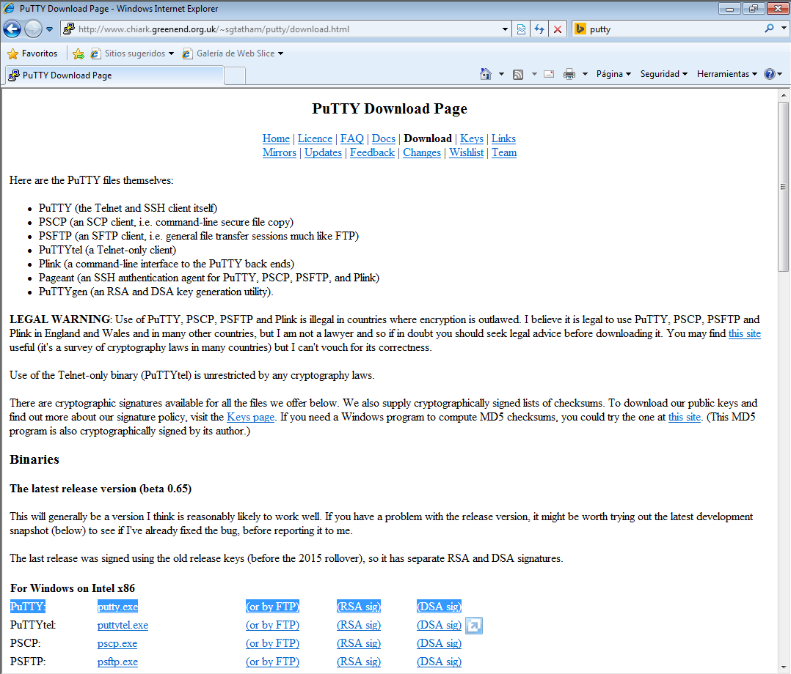
	
* Y lo instalamos.

	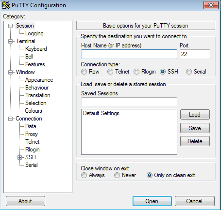

* Configurar el cliente2 Windows con los siguientes valores:
    * Nombre de usuario: michele
    * Clave del usuario administrador: DNI-del-alumno
    * Nombre de equipo: ssh-client2-10
    * IP estática
    
    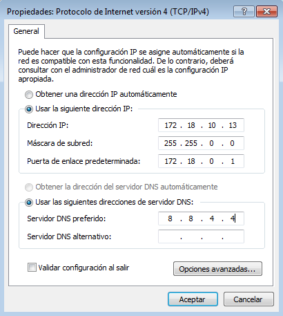
    
* Añadir en `C:\Windows\System32\drivers\etc\hosts` el equipo ssh-server y ssh-client1.

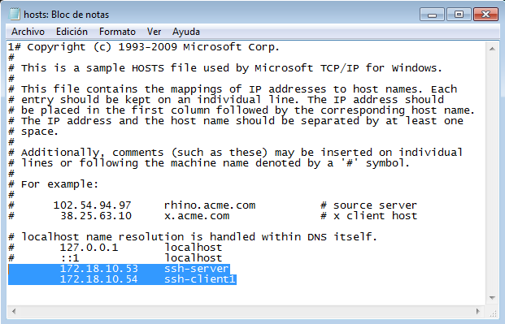

* Comprobar haciendo ping a ambos equipos. 

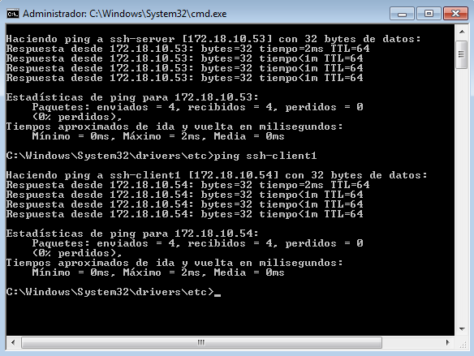

#3 Instalación del servicio SSH

* Instalamos el servicio SSH en la máquina ssh-server desde terminal `zypper install openssh`.

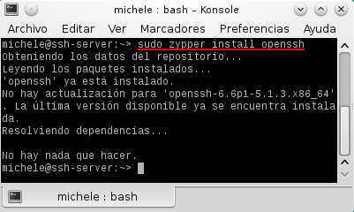

##3.1 Comprobación

* Desde el propio **ssh-server**, verificar que el servicio está en ejecución. `systemctl status sshd`


* Para poner el servicio enable: `systemctl enable sshd`, si no lo estuviera.

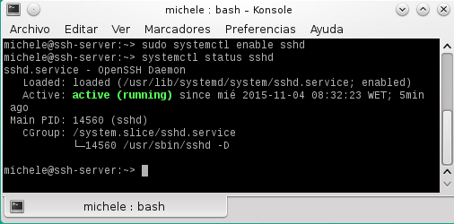


##3.2 Primera conexión SSH desde cliente

* Configuramos el cortafuegos para permitir el acceso ssh:

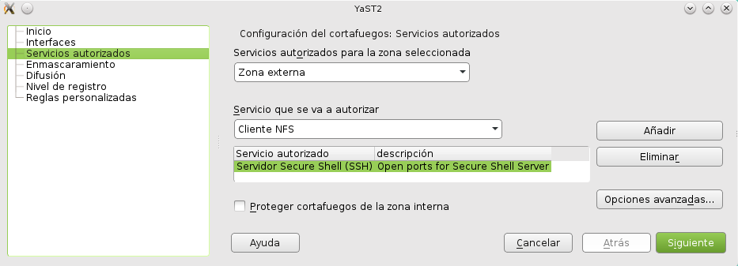

 
* Vamos a realizar nuestra primera conexión desde el **ssh-cliente1** mediante `ssh linares1@ssh-server`. 

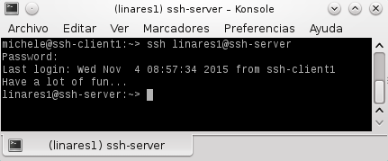


* Comprobamos el contenido del fichero `$HOME/.ssh/known_hosts` en el equipo ssh-client1 que muestra la clave.

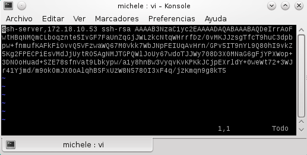


##3.3 ¿Y si cambiamos las claves del servidor?

* Para ello modificamos el fichero de configuración SSH (`/etc/ssh/sshd_config`) para dejar una única línea: 
`HostKey /etc/ssh/ssh_host_rsa_key`.

Este parámetro define los ficheros de clave publica/privada que van a identificar a nuestro
servidor.

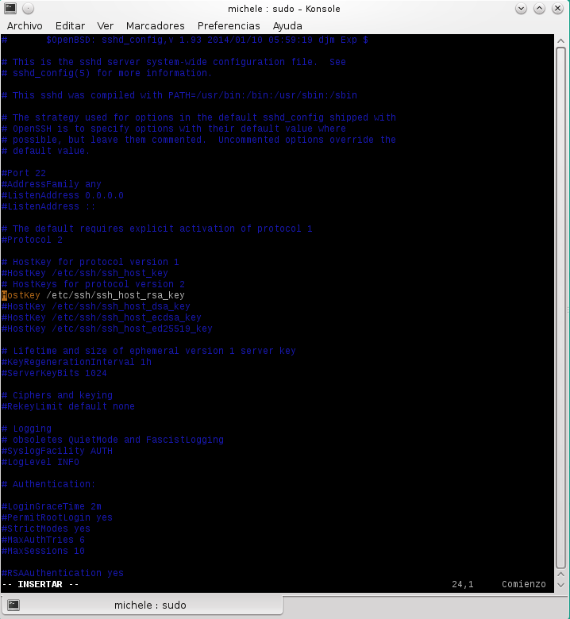


* Generamos nuevas claves de equipo en **ssh-server**: 
`ssh-keygen -t rsa -f /etc/ssh/ssh_host_rsa_key`.

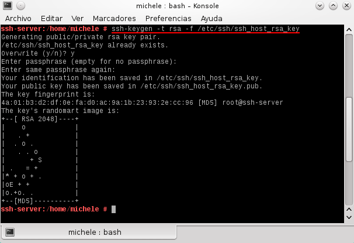

* Reiniciar el servicio SSH: `systemctl restart sshd`.

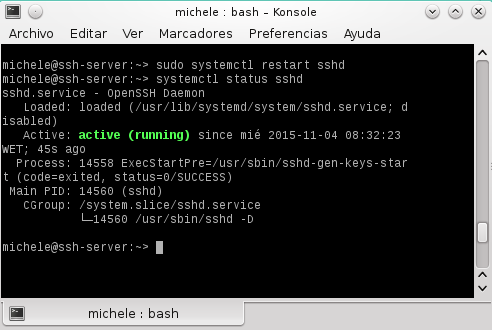

* Comprobamos qué sucede al volver a conectarnos desde los dos clientes, usando los usuarios linares2 y linares1.

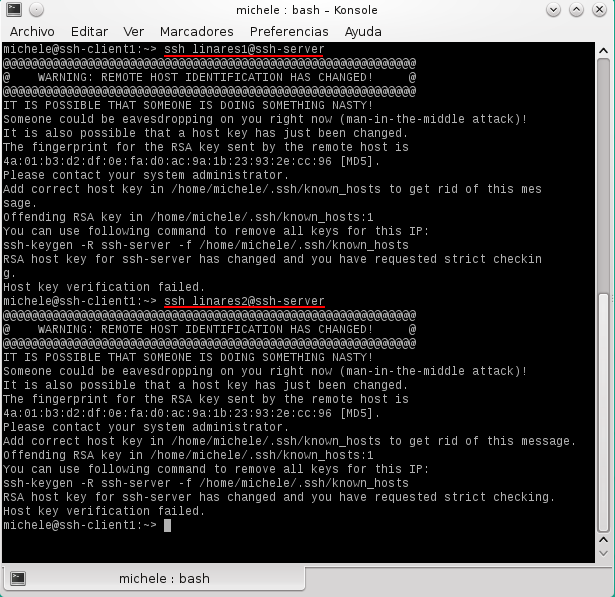

Vemos que las claves han cambiado por lo qu no tenemos acceso y no podemos conectarnos mediante ssh.

#4. Personalización del prompt Bash


* Por ejemplo, podemos añadir las siguientes líneas al fichero de configuración del usuario1 en la máquina servidor (`Fichero /home/1er-apellido-alumno1/.bashrc`)

```
#Cambia el prompt al conectarse vía SSH

if [ -n "$SSH_CLIENT" ]; then
  PS1="AccesoRemoto_\e[32;40m\u@\h: \w\a\$"
else
  PS1="\[$(ppwd)\]\u@\h:\w>"
fi
```
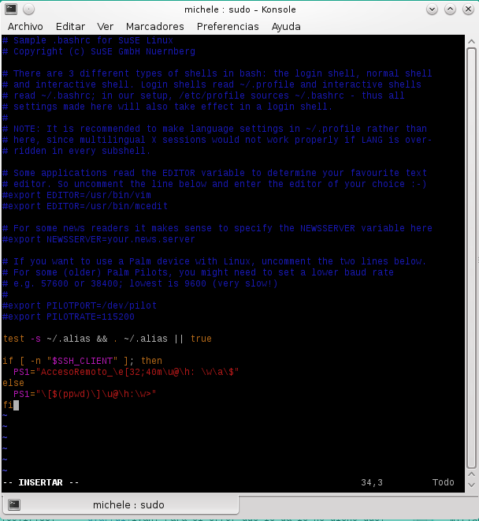

* Además, crear el fichero `/home/linares1/.alias` con el siguiente contenido:
```
alias c='clear'
alias g='geany'
alias p='ping'
alias v='vdir -cFl
alias s='ssh'
```

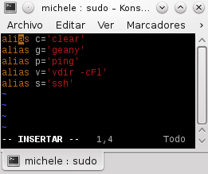

* Comprobamos el funcionamiento de la conexión SSH. 

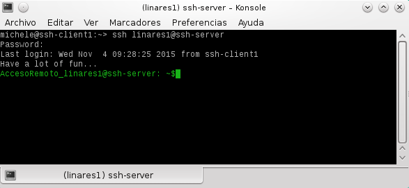 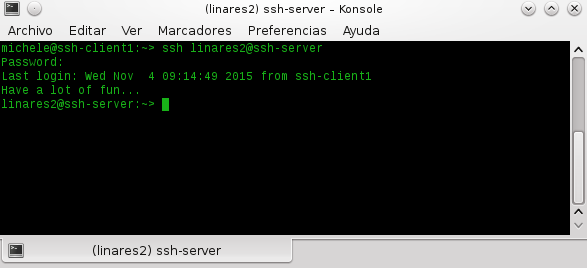

#5. Autenticación mediante claves públicas

Vamos a acceder desde el cliente1, para que el usuario `linares4` entre sin poner password, pero usando claves pública/privada.

Para ello desde la máquina *ssh-client1* realizamos estos pasos:

* Ejecutamos `ssh-keygen -t rsa` para generar un nuevo par de claves.

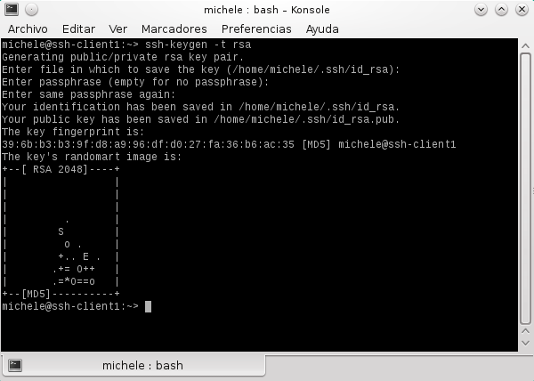

* Ahora vamos a copiar la clave pública (id_rsa.pub) del usuario (michele) de la máquina cliente, al fichero "authorized_keys" del usuario *linares4* en el servidor, con el comando `ssh-copy-id linares4@ssh-server`
    
    
    
* Comprobar que ahora podremos acceder remotamente, sin escribir el password desde el cliente1.
* Comprobar que al acceder desde cliente2, si nos pide el password.

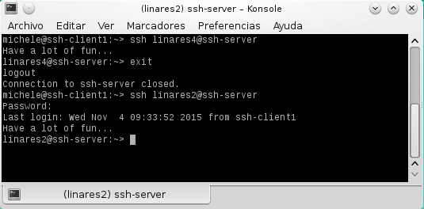

#6. Uso de SSH como túnel para X


* Instalar en el servidor una aplicación de entorno gráfico que no esté en los clientes. Por ejemplo Geany. 


* Modificar servidor SSH para permitir la ejecución de aplicaciones gráficas, desde los clientes. 
Consultar fichero de configuración `/etc/ssh/sshd_config` (Opción `X11Forwarding yes`)

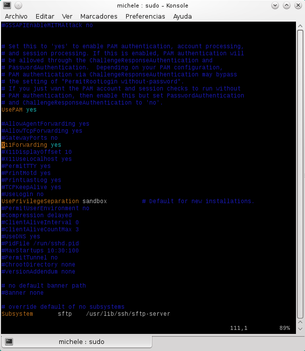

* Comprobar funcionamiento de Geany desde cliente1.
Por ejemplo, con el comando `ssh -X linares1@ssh-server`, podemos conectarnos de forma remota al servidor, y ahora ejecutamos Geany de forma remota.

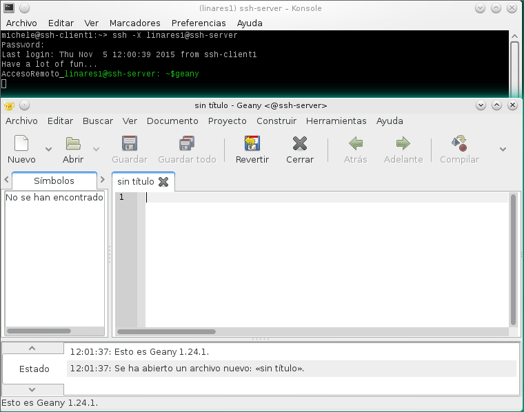

#7. Aplicaciones Windows nativas

Podemos tener aplicaciones Windows nativas instaladas en ssh-server mediante el emulador WINE.
* Instalar emulador Wine en el ssh-server.

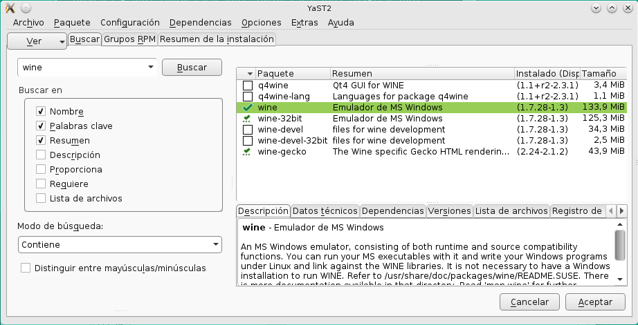

* Probamos a ejecutar el Bloc de Notas con Wine: wine notepad.

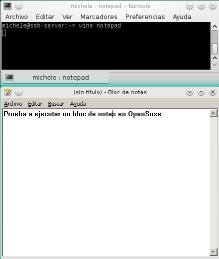

* Comprobamos el funcionamiento, accediendo desde ssh-client1.

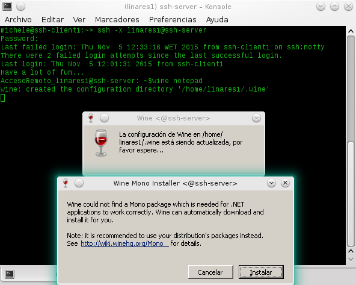


#8. Restricciones de uso
Vamos a modificar los usuarios del servidor SSH para añadir algunas restricciones de uso del servicio.

##8.1 Sin restricción (tipo 1)
Usuario sin restricciones:

* El usuario linares1, podrá conectarse vía SSH sin restricciones.


##8.2 Restricción total (tipo 2)
Vamos a crear una restricción de uso del SSH para un usuario:

* Modificamos el fichero de configuración del servidor SSH (`/etc/ssh/sshd_config`) para restringir el acceso a *linares2*. 

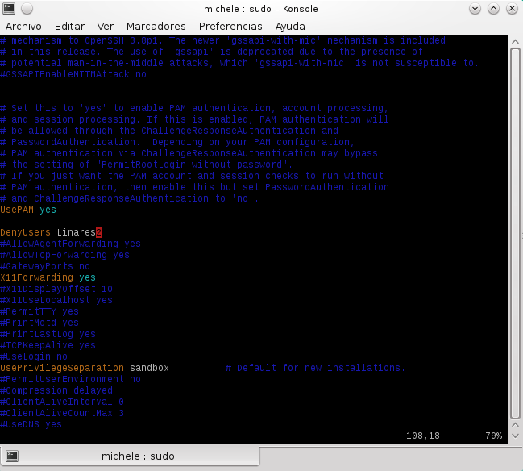

* Comprobarlo la restricción al acceder desde los clientes.

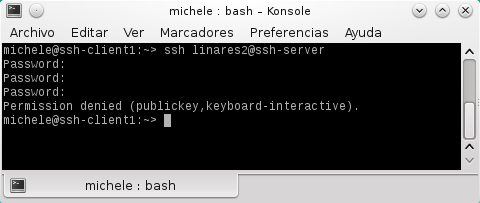

##8.3 Restricción en las máquinas (tipo 3)
Vamos a crear una restricción para que sólo las máquinas clientes con las IP's 
autorizadas puedan acceder a nuestro servidor.

* Denegamos a todos (ALL) en los ficheros de configuración /etc/hosts.deny.

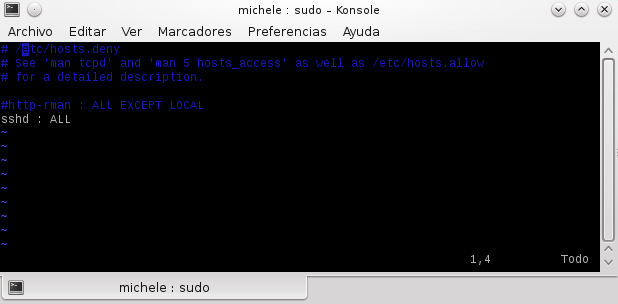

* Y permitimos solo a la IP conocidas.


* Comprobamos su funcionamiento.

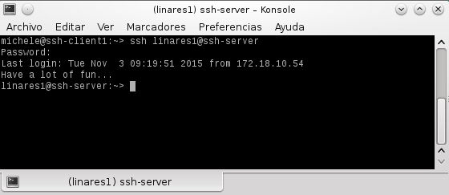

##8.4 Restricción sobre aplicaciones (tipo 4)
Vamos a crear una restricción de permisos sobre determinadas aplicaciones.

* Usaremos el usuario linares4
* Crear grupo remoteapps e incluir al usuario en el grupo.

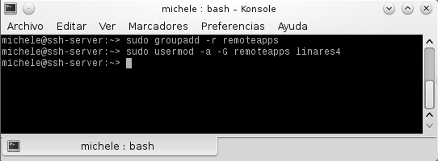

* Poner al programa APP1 el grupo propietario a remoteapps y los permisos 750.

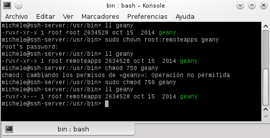

* Comprobamos el funcionamiento en el servidor.

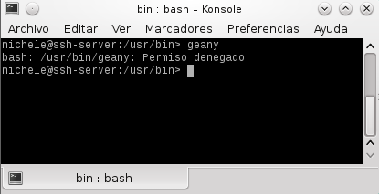

* Comprobamos el funcionamiento desde el cliente.

Con *linares4* lo ejecutamos sin problemas

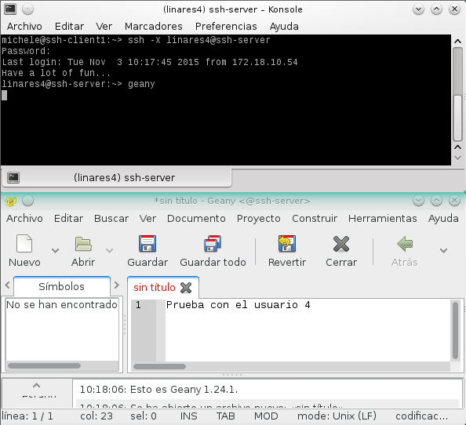

Pero con *linares1* no podemos.

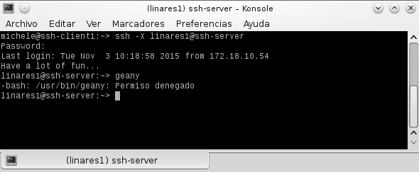

