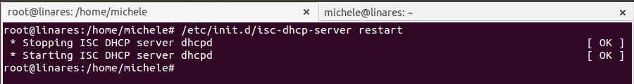

# 1. Clientes ligeros con LTSP


## 1.1 Configuracon en el Servidor LTSP

La MV del servidor necesitará dos interfaces de red, una interfaz externa:

* para comunicarse con Internet.
* Configurarla en VBox como adaptador puente.
* IP estática 172.18.10.41
y una interfaz interna
* para conectarse con los clientes ligeros.
* La IP de esta interfaz de red debe ser estática y debe estar en la misma red que los clientes (IP 192.168.0.1).
* Configurarla en VBox como "red interna".

En cuanto al sistema debe tener:

* Nombre de usuario: nombre-del-alumno, en minúsculas, sin tildes ni eñes. 
* Clave de root, poner como clave el DNI con la letra en minúsculas.
* Poner como nombre de equipo el primer apellido del alumno en minúsculas y sin tildes.
* Poner como nombre de dominio el segundo apellido del alumno en minúsculas y sin tildes.


	**Todo lo anterior queda demostrado con los comandos siguientes:**

![img] (./1.png)


   **Además debemos crear  3 usuarios:**

![img] (./2.png)


## 1.2 Instalar el servicio LTSP

* Para instalar el servidor SSH utilizamos el comando`apt-get install openssh-server`.

![img] (./7.png)

* Debemos dar los permisos modificando el fichero de configuración para poder acceder vía SSH

![img] (./5.png)

* Instalar servidor de clientes ligeros con el comando `apt-get install ltsp-server-standalone`.

![img] (./3.png)

* Ahora vamos a crear un imagen del SO a partir del sistema real haciendo `ltsp-build-client`.

![img] (./4.png)


* Consultamos el fichero de configuración del servicio DHCP instalado junto con LTSP `/etc/ltsp/dhcpd.conf`. 

 Este sería el que viene por defecto 

![img] (./8.png)


 + Al nosotros utilizar una máquina de 64 bits debemos cambiar la ruta:


![img] (./15.png)


* Reiniciamos el servicio DHCP `/etc/init.d/isc-dhcp-server status`.



* Debemos editar el fichero de TFTP siguiente `/etc/init.d/tftpd-hpa` Y establecemos la variable TFTP_ADDRESS al valor de la IP:ADDRESS de la interfaz de trabajo, esto es `192.168.0.1:69`.

![img] (./13.png)

# 2. Preparar MV Cliente
Crear la MV cliente en VirtualBox:

* Sin disco duro y sin unidad de DVD.
* Sólo tiene RAM.
* Tarjeta de red PXE en modo "red interna".

![img] (./10.png)


# 3. Comprobación

+ Con nuestro servidor encendido iniciamos nuestra máquina cliente automáticamente deberia de darnos IP.

![img] (./11.png)

+ Una vez que argar la imagen que creamos en los pasos anteriores no pide usuario y contraseña para acceder.

![img] (./17.png)

Con el cliente conctado comprobamos los siguiente comandos:

```
arp
whoami
who
```
![img] (./18.png)


* Reiniciar la MV cliente y grabamosun vídeo mostrando el funcionamiento.

[Video](https://www.youtube.com/embed/OphXtSjNsg4)
