#TAREAS PROGRAMADAS

#1. SO OpenSUSE

##1.1 Configuración de la máquina

Configurar el equipo GNU/Linux OpenSUSE 13.2 con:

* IP: 172.18.10.51
* Máscara de red: 255.255.0.0
* Gateway: 172.18.0.1
* Servidor DNS: 8.8.4.4
* Nombre de equipo: linares3
* Nombre de dominio: donofrio

Para comprobarlo utilizaremos los siguiente comandos:

    uname -a
    hostname -a
    hostname -d
    ip a
    route -n
    blkid

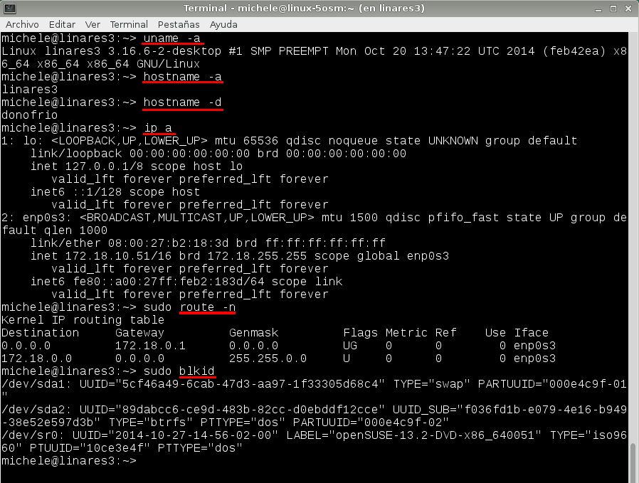

Comprobamos que tenemos openssh-server instalador para que el profesor pueda acceder de forma remota.

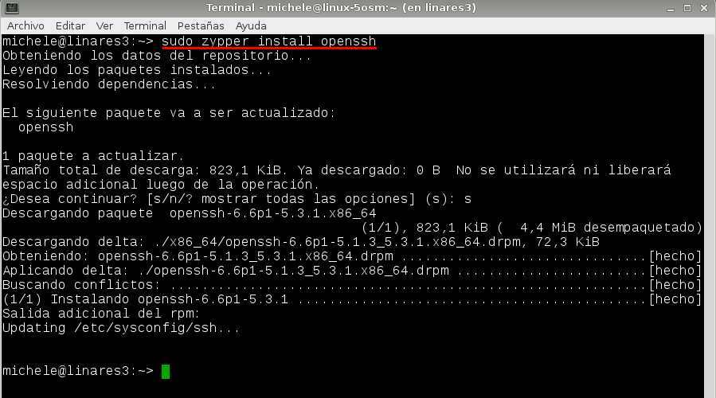

##1.2 Tarea diferida

Antes de nada comprobamos que el servicio `atd` (responsable de la ejecución de los comandos at) está activo y en ejecución.

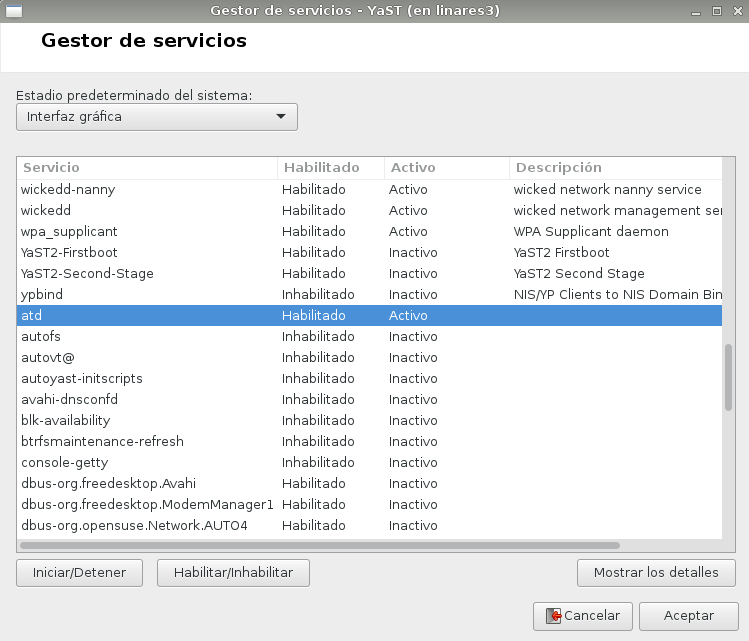

* Vamos a programar una tarea diferida (comando `at`) que apague la máquina. La vamos a programar para dentro de 1 minuto.

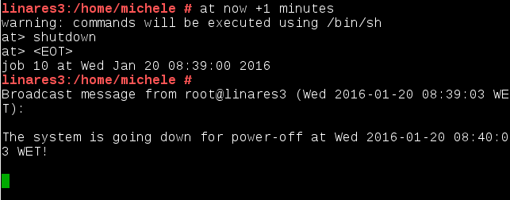

##1.3 Tarea periódica

* Programar una tarea periódica (crontab) que muestre un mensaje. Este mensaje los vamos crear en un script de la siguiente forma.

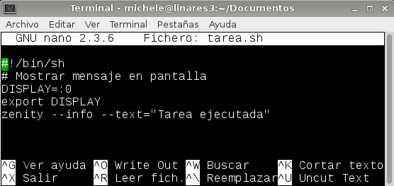

* Para programar una tarea periódica utilizaremos el comando `crontab -e`. En el escribimos el comando con el tiempo y/o fecha en la que vamos a ejecutar la tarea.

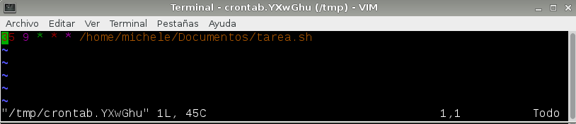

* Si utilizamos el comando `crontab -l` vemos las tareas que tenemos programadas.

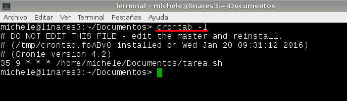

* A la hora programada nos aparece el mensaje.

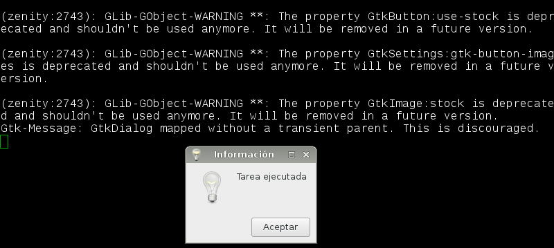

##1.4 Tarea asíncrona

> Para definir una tarea asíncrona ponemos el script de ejecución en alguno 
de los directorios siguientes:

> * /etc/cron.hourly
> * /etc/cron.daily
> * /etc/cron.weekly
> * /etc/cron.monthly

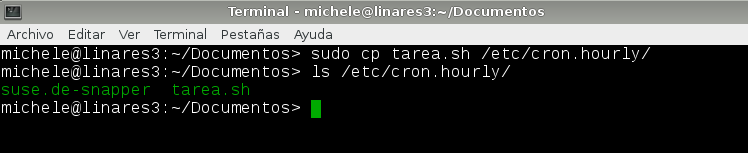
    
#2. Windows 7

##2.1 Configuración de la máquina

Configuración máquina *Windows 7* con:

* IP: 172.18.10.11 
* Nombre de equipo: linares1
* Máscara de red: 255.255.0.0
* Gateway: 172.18.0.1
* Servidor DNS: 8.8.4.4
* Grupo de trabajo: AULA108

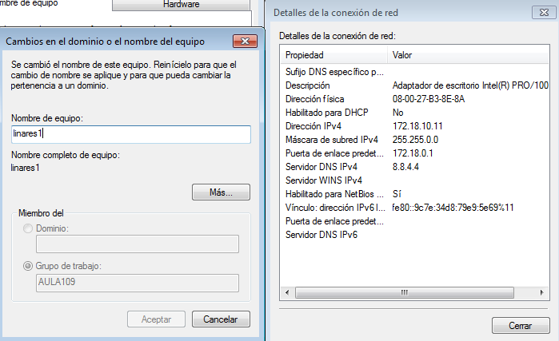

##2.2 Tarea diferida

* Vamos a programar una tarea diferida para que nos muestre un mensaje de ánimo en pantalla.
* Abrimos el programador de tareas en `Panel de control -> Herramientas administrativas -> Programador de tareas` y creamos la nueva tarea.

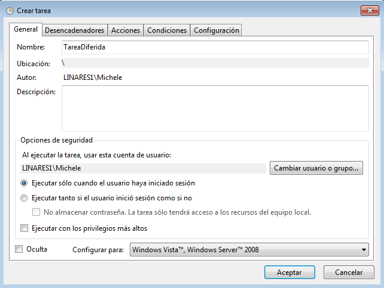

* Especificamos para que es nuestra tarea en este caso un mensaje.

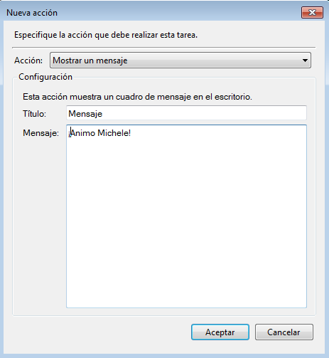

* Y finalmente vemos que según la tengamos programada nos aparece el mensaje.

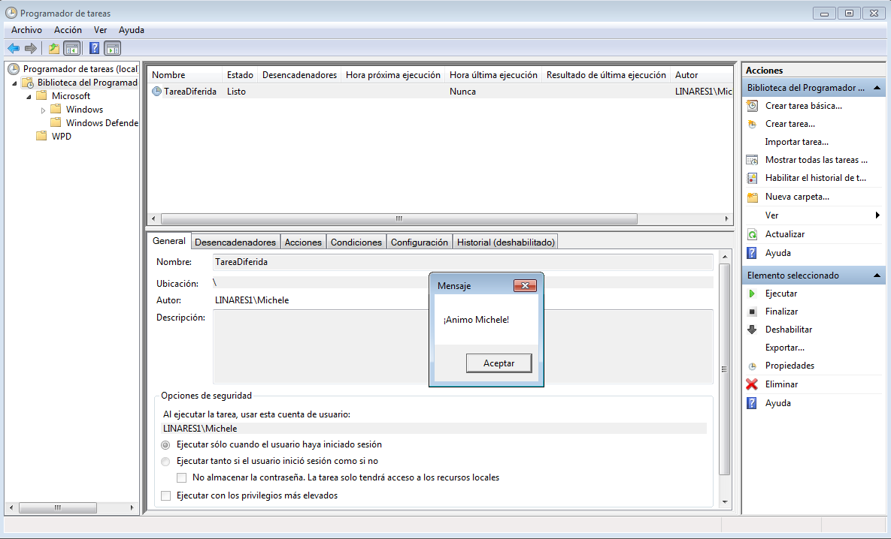

##2.3 Tarea periódica

* Vamos a programar una tarea periódica para apagar el equipo.
* El comando para apagar el sistema es `shutdown`.

* Para ello creamos nuevamente una tarea.

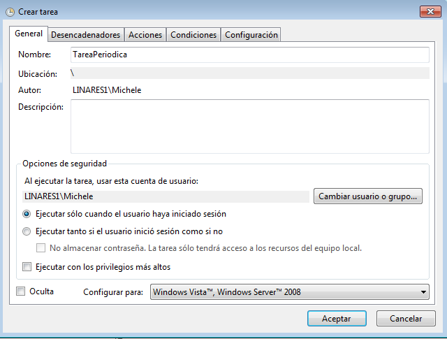

* La programamos a nuestro gusto.

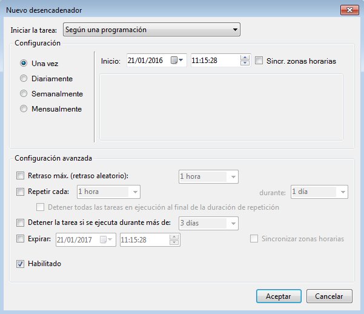

* Pero esta vez vamos a usa el comando shutdown con el argumento /s para que sea programada.

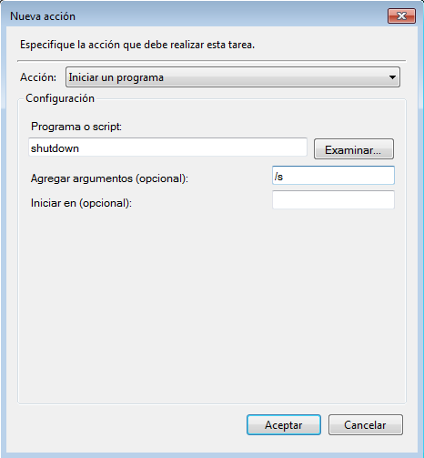

* Comprobamos que pasado el tiempo nuestro ordenador se apagará.

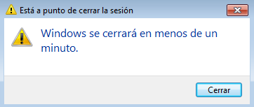

##2.4 Tarea asíncrona

* Vamos a programar una tarea asíncrona para realizar una copia de backup de nuestros documentos a otra carpeta del disco duro.
* Creamos un fichero `backup.bat` con la siguiente instrucción `xcopy`:

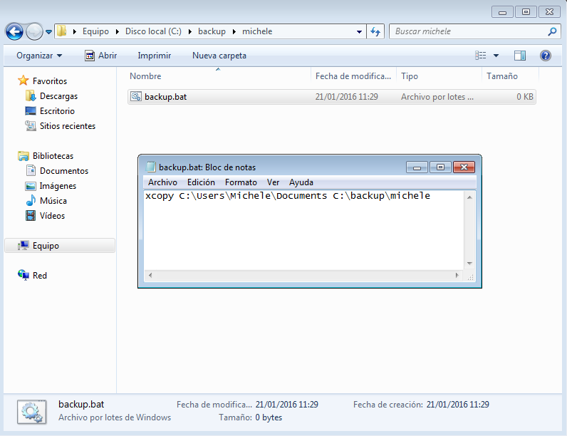

* Creamos una nueva tarea y le decimos que inicie este script semanalmente.

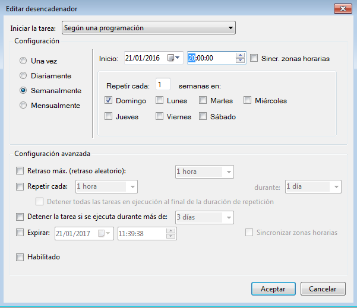

* Comprobamos con un fichero llamado `Prueba.txt` que la copia se esta haciendo correctamente.

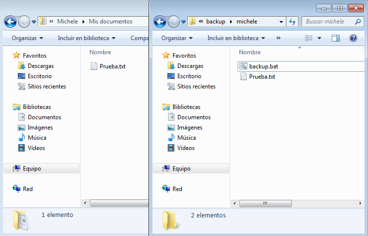

