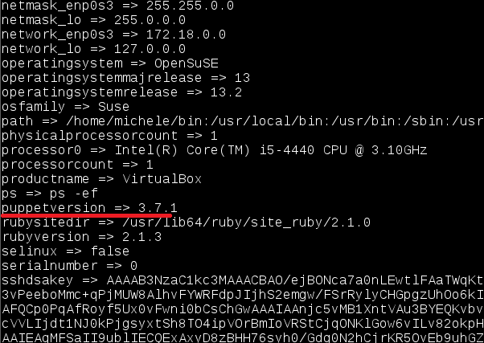

#1. Puppet

##1.1 Preparación MVs

- Vamos a usar 3 MV's con las siguientes configuraciones:

	* MV1 - master: Dará las órdenes de instalación/configuración a los clientes.
	    * SO GNU/Linux OpenSUSE 13.2
	    * IP estática 172.18.10.100
	    * Enlace: 172.18.0.1
	    * DNS: 8.8.4.4
	    * Nombre del equipo: master10
	    * Dominio = linares
	    * Instalar OpenSSH.
	* MV1 - client1: recibe órdenes del master.
	    * SO GNU/Linux OpenSUSE 13.2
	    * IP estática 172.18.10.101
	    * Enlace: 172.18.0.1
	    * DNS: 8.8.4.4
	    * Nombre del equipo: cli1alu10
	    * Dominio = primer-apellido-del-alumno
	    * Instalar OpenSSH.
	* MV3 - client2: recibe órdenes del master.
	    * SO Windows 7.
	    * IP estática 172.18.10.102
	    * Enlace: 172.18.0.1
	    * DNS: 8.8.4.4
	    * Nombre Netbios: cli2alu10
	    * Nombre del equipo: cli2alu10
	    * Grupo de trabajo = AULA108
	    * Instalar Servidor.
 
Cada MV debe tener configurada en su `/etc/hosts` al resto. 

**GNU/Linux**

- El fichero `/etc/hosts` tiene este contenido:


 	

 **Windows**

- En el fichero hosts de Windows tenemos ese contenido:

 	


##1.2 Comprobacion de las configuraciones

En GNU/Linux, para comprobar que las configuraciones son correctas hacemos:
  
    ```
	date
	ip a
	route -n
    host www.google.es
    hostname -a
    hostname -f
    hostname -d
    ping master10
    ping master10.linares
    ping cli1alu10
    ping cli1alu10.linares
    ping cli2alu10
    ping cli2alu10.linares  
    ```

   
   

En Windows comprobamos con:

    ```
    date
    ipconfig
    route /PRINT
    nslookup www.google.es
    ping master10
    ping master10.linares
    ping cli1alu10
    ping cli1alu10.linares
    ping cli2alu10
    ping cli2alu10.linares
    ```

   
   


#2. Instalación y configuración Puppet

* Instalamos Puppet Master en la MV master10: `zypper install puppet-server puppet puppet-vim`.

  	

* `systemctl status puppetmaster`: Consultar el estado del servicio.

 	

* Preparamos los ficheros/directorios en el master10:

    ```
    mkdir /etc/puppet/files
	mkdir /etc/puppet/manifests
	mkdir /etc/puppet/manifests/classes
	touch /etc/puppet/files/readme.txt
	touch /etc/puppet/manifests/site.pp
	touch /etc/puppet/manifests/classes/hostlinux1.pp
    ```

   

##2.1 /etc/puppet/manifests/site.pp

* `/etc/puppet/manifests/site.pp` es el fichero principal de configuración 
de órdenes para los agentes/nodos puppet.
* Contenido de nuestro `site.pp`:

    

> Esta configuración significa:
> * Todos los ficheros de configuración del directorio classes se añadirán a este fichero.
> * Todos los nodos/clientes van a usar la configuración `hostlinux1`

##2.2 /etc/puppet/manifests/classes/hostlinux1.pp

Como podemos tener muchas configuraciones, vamos a separarlas en distintos ficheros para
organizarnos mejor, y las vamos a guardar en la ruta `/etc/puppet/manifests/classes`

* Vamos a crear una primera configuración para máquina estándar GNU/Linux.
* Contenido para `/etc/puppet/manifiests/classes/hostlinux1.pp`:


* Reiniciamos el servicio `puppetmaster`.


* Comprobamos que el servicio está en ejecución de forma correcta.
    * `systemctl status puppetmaster`
    * `netstat -ntap`


#3. Instalación y configuración del cliente1

* Instalamos Agente Puppet en el cliente: `zypper install puppet`


* El cliente puppet debe ser informado de quien será su master. 
Para ello, añadimos a `/etc/puppet/puppet.conf`:

```
    [main]
    server=maste10.linares
    ...
```


* Activar el servicio en cada reinicio de la máquina e iniciar el servicio puppet.


* `systemctl status puppet`: Ver el estado del servicio puppet.


#4. Certificados

Antes de que el master acepte a cliente1 como cliente, se deben intercambiar los certificados entre 
ambas máquinas. Esto sólo hay que hacerlo una vez.

##4.1 Aceptar certificado

* Vamos al master y consultamos las peticiones pendiente de unión al master: `puppet cert list`
* Aceptar al nuevo cliente desde el master `puppet cert sign cli1alu10.linares`
* Y conprobamos nuestro certificado con `puppet cert print cli1alu10.linares`


##4.2 Comprobación final

* Vamos a cliente1 y reiniciamos la máquina y/o el servicio Puppet.


* Comprobar que los cambios configurados en Puppet se han realizado.


#5. Segunda versión del fichero pp

Ya hemos probado una configuración sencilla en PuppetMaster. 
Ahora vamos a pasar a configurar algo más complejo.

* Contenido para `/etc/puppet/manifests/classes/hostlinux2.pp`:


* Modificar `/etc/puppet/manifests/site.pp` con:


#6. Cliente puppet windows

Vamos a configurar Puppet para atender también a clientes Windows.

##6.1 Modificaciones en el Master

* En el master vamos a crear una configuración puppet para las máquinas windows, 
dentro del fichero `/etc/puppet/manifests/classes/hostwindows3.pp`, con el siguiente contenido:


* Ahora vamos a modificar el fichero `site.pp` del master, para que tenga en cuenta
la configuración de clientes GNU/Linux y clientes Windows, de la siguiente forma:


* Reiniciamos el servicio PuppetMaster.
* Ejecutamos el comando `facter`, para ver la versión de Puppet que está usando el master.





##6.2 Modificaciones en el cliente2

* Ahora vamos a instalar AgentePuppet en Windows. Recordar que debemos instalar la misma versión en
ambos equipos (Usar comando `facter` para ver la versión de puppet).

 	

* Le decimos al agente Puppet el nombre del servidor master.

 	 

* Debemos generar el certificado en el cliente.

 	

* Y lo aceptamos en el master.

 	
 	


* Iniciar consola puppet como administrador y probar los comandos: 
    * `puppet agent --server master10.linares --test`: Comprobar el estado del agente puppet.

	

    * `facter`: Para consultar datos de la máquina windows.

		

    * `puppet resource user nombre-alumno1`: Para ver la configuración puppet del usuario.
    * `puppet resource file c:\Users`: Para var la configuración puppet de la carpeta.
    
	

* Comprobamos que se nos ha creado el archivo.

 	

##6.3 Segunda version de hostwindows3.pp

* Configuración en el master del fichero `/etc/puppet/manifests/classes/hostwindows3.pp` 
para el cliente Windows:

 	

* Después de realizar los cambios pertinentes en el fichero site.pp y reiniciar todo, comprobamos que realmente se crean los usuarios.

 	

##6.4 configuración elegida por el alumno.

* Creamos el fichero con `/etc/puppet/manifests/classes/hostwindows4.pp` para eliminar el archivo anteriormente creado.

 	

* Lo comprobamos.

 	


