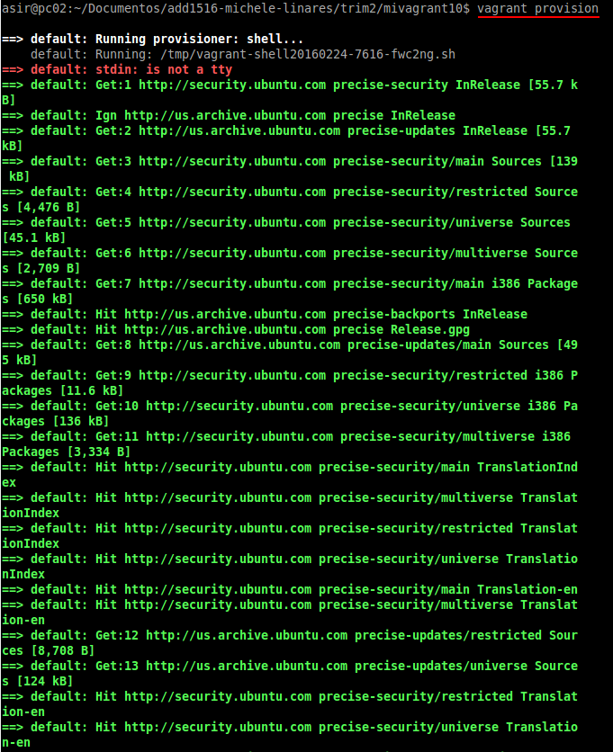
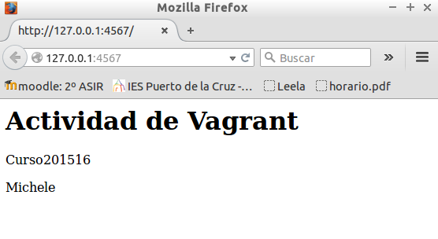

#1. Vagrant

##1.1 Instalar


* Vamos a usar el paquete `Vagrant-deb` que nos descargamos del servidor *Leela* y los instalamos.


##1.2. Proyecto
* Crear un directorio para nuestro proyecto vagrant.

```
mkdir mivagrant10
cd mivagrant10
vagrant init
```


##1.3 Imagen, caja o box

* Ahora necesitamos obtener una imagen(caja, box) de un sistema operativo. Por ejemplo:
`vagrant box add micaja10_ubuntu_precise32 http://files.vagrantup.com/precise32.box`


* Para usar una caja determinada en nuestro proyecto, modificamos el fichero `Vagrantfile` 
de la carpeta del proyecto.
* Cambiamos la línea `config.vm.box = "base"` por  `config.vm.box = "micaja10_ubuntu_precise32"`.


##1.4 Iniciar la máquina

Vamos a iniciar la máquina virtual creada con Vagrant.

`vagrant up`: comando para iniciar una la instancia de la máquina.


* Podemos usar ssh para conectar con nuestra máquina virtual (`vagrant ssh`).


* Podemos ver que se nos ha creado en virtualbox.


#2. Configuración

##2.1 Redireccionamiento de los puertos

Uno de los casos más comunes cuando tenemos una máquina virtual es la 
situación que estamos trabajando con proyectos enfocados a la web, 
y para acceder a las páginas no es lo más cómodo tener que meternos 
por terminal al ambiente virtual y llamarlas desde ahí, aquí entra en 
juego el enrutamiento de puertos.

* Modificar el fichero `Vagrantfile`, de modo que el puerto 4567 del 
sistema anfitrión será enrutado al puerto 80 del ambiente virtualizado.

`config.vm.network :forwarded_port, host: 4567, guest: 80`


* Luego iniciamos la MV (si ya se encuentra en ejecución lo podemos refrescar 
con `vagrant reload`)


* En nuestro sistema anfitrión nos dirigimos al explorador de internet,
 y colocamos: `http://127.0.0.1:4567`. En realidad estaremos accediendo 
 al puerto 80 de nuestro sistema virtualizado. 


#3.Suministro

##3.1 Suministro mediante script

Quizás el aspecto con mayor beneficios del enfoque que usa Vagrant 
es el uso de herramientas de suministro, el cual consiste en correr 
una receta o una serie de scripts durante el proceso de levantamiento 
del ambiente virtual que permite instalar y configurar un sin fin 
piezas de software, esto con el fin de que el ambiente previamente 
configurado y con todas las herramientas necesarias una vez haya sido levantado.

Por ahora suministremos al ambiente virtual con un pequeño script que instale Apache.

* Crear el script `install_apache.sh`, dentro del proyecto con el siguiente
contenido:

```
    #!/usr/bin/env bash

    apt-get update
    apt-get install -y apache2
    rm -rf /var/www
    ln -fs /vagrant /var/www
    echo "<h1>Actividad de Vagrant</h1>" > /var/www/index.html
    echo "<p>Curso201516</p>" >> /var/www/index.html
    echo "<p>Nombre-del-alumno</p>" >> /var/www/index.html
```


* Modificar Vagrantfile y agregar la siguiente línea a la configuración:
`config.vm.provision :shell, :path => "install_apache.sh"`


* Iniciamos la MV o `vagrant reload` si está en ejecución para que coja el cambio de la configuración.


* Y para que los cambios sean efectivos necesitamos realizar un `vagrant provision`.



* Para verificar que efectivamente el servidor Apache ha sido instalado e iniciado, 
abrimos navegador en la máquina real con URL `http://127.0.0.1:4567`.



##3.2 Suministro mediante Puppet

* Vagrantfile configurado con puppet:


* Fichero de configuración de puppet:


* Volvemos a realizar un `vagrant provision` para cargar los cambios y observamos que todo ha salido correctamente.


